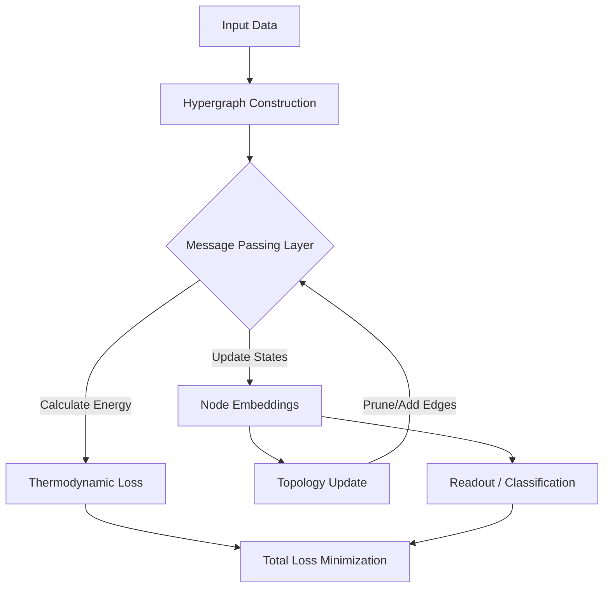

# Nova: Thermodynamic Hypergraph AGI


## Abstract

**Nova** is an experimental AGI research framework that integrates **Friston’s Free Energy Principle** with **Dynamic Hypergraph Architectures**. By modeling cognition as a thermodynamic process on a changing topology, Nova attempts to minimize variational free energy not just through parameter updates, but through structural evolution of the compute graph itself.

Key innovations:
- **Thermodynamic Loss**: Optimizes for energy efficiency alongside accuracy.
- **Dynamic Topology**: The neural graph structure evolves during training (edges are added/pruned based on information flow).

## Quick Start

### Installation

1. Clone the repository:
   ```bash
   git clone https://github.com/your-username/nova.git
   cd nova
   ```

2. Install dependencies:
   ```bash
   pip install -r nova_agi/requirements.txt
   ```

### Training

To train NovaNet on synthetic hypergraphs or the ZINC dataset:

```bash
# Run with default configuration (Synthetic Data)
python nova_agi/scripts/train.py

# Run with ZINC dataset
python nova_agi/scripts/train.py dataset=zinc
```

## Architecture

NovaNet processes data through a dynamic hypergraph message-passing mechanism.



## License

This project is licensed under the MIT License.
